# Essay Agent System Architecture Analysis - 100x Comprehensive Prompt

## 🎯 Mission: Create Complete System Architecture Diagram

You are tasked with conducting a **comprehensive analysis** of the essay writing agent system and creating a **detailed system architecture diagram** that shows exactly how user input flows through the entire system to generate personalized responses.

## 🔍 Analysis Objectives

### Primary Goal
Create a **visual system architecture diagram** (Mermaid flowchart) that clearly shows:
1. **User Input Entry Points** - Where requests come into the system
2. **Agent Planning Flow** - How the agent reasons and selects actions
3. **Context Engine Integration** - How user context is managed and injected
4. **Tool Execution Pipeline** - How tools are selected, parameterized, and executed
5. **Response Generation** - How tool results are composed into final responses
6. **Memory & Persistence** - How user data is stored and retrieved
7. **Data Flow** - Complete path from user input to final response

### Secondary Goals
- **Identify key components** and their responsibilities
- **Map data flow** between components
- **Understand integration points** where components interact
- **Document the ReAct pattern** implementation (Observe → Reason → Act → Respond)
- **Show context injection** at each stage

## 📁 Key Files to Analyze Systematically

### 1. Core Agent Components
```
🔍 EXAMINE THESE FILES FIRST:
- essay_agent/agent_autonomous.py (Main agent implementation)
- essay_agent/frontend/server.py (Frontend interface & debug agent)
- essay_agent/intelligence/context_engine.py (Context management)
- essay_agent/memory/simple_memory.py (User profile storage)
- essay_agent/utils/arg_resolver.py (Parameter resolution)
```

### 2. Tool Execution System
```
🔍 EXAMINE THESE TOOL FILES:
- essay_agent/tools/smart_orchestrator.py (Tool selection & execution)
- essay_agent/tools/integration.py (Tool integration helpers)
- essay_agent/tools/__init__.py (Tool registry)
- essay_agent/tools/brainstorm_tools.py (Example tool implementation)
```

### 3. Memory & Context System
```
🔍 EXAMINE THESE MEMORY FILES:
- essay_agent/memory/ (All memory-related files)
- essay_agent/intelligence/ (Context & quality engines)
- memory_store/alex_kim.json (Example user profile)
```

### 4. Frontend Integration
```
🔍 EXAMINE THESE FRONTEND FILES:
- essay_agent/frontend/server.py (Web interface)
- essay_agent/cli.py (CLI interface)
- essay_agent/demo.py (Demo implementation)
```

## 🔬 Systematic Analysis Process

### Phase 1: Entry Points Analysis
**Question**: How does user input enter the system?
- Examine frontend/server.py for web interface entry points
- Examine cli.py for command-line interface
- Identify the main methods that receive user input
- Map how input gets passed to the core agent

### Phase 2: Agent Core Analysis  
**Question**: How does the autonomous agent work?
- Examine agent_autonomous.py in detail
- Identify the ReAct pattern implementation (_observe, _reason, _act, _respond)
- Understand how the agent decides what to do with user input
- Map the decision-making flow

### Phase 3: Context Engine Analysis
**Question**: How is user context managed?
- Examine intelligence/context_engine.py
- Understand how user profiles are loaded and injected
- See how context snapshots are created
- Map context flow through the system

### Phase 4: Tool Execution Analysis
**Question**: How are tools selected and executed?
- Examine tools/smart_orchestrator.py for tool selection logic
- Examine utils/arg_resolver.py for parameter resolution
- Understand how tools receive context and parameters
- Map the tool execution pipeline

### Phase 5: Response Generation Analysis
**Question**: How are final responses created?
- Examine _compose_response() in agent_autonomous.py
- Understand how tool results are turned into natural responses
- See how personalization is applied
- Map the response generation flow

### Phase 6: Memory System Analysis
**Question**: How is user data persisted and retrieved?
- Examine memory/simple_memory.py
- Understand user profile structure
- See how conversation history is maintained
- Map memory operations throughout the system

## 🎨 Architecture Diagram Requirements

### Diagram Structure
Create a **comprehensive Mermaid flowchart** with these components:

#### 1. User Interface Layer
- Web Frontend (server.py)
- CLI Interface (cli.py)
- Demo Interface (demo.py)

#### 2. Agent Core Layer
- AutonomousEssayAgent (main controller)
- ReAct Pattern Flow (observe → reason → act → respond)
- Decision Making Logic

#### 3. Intelligence Layer
- ContextEngine (context management)
- QualityEngine (response enhancement)
- Memory System (user profiles, conversations)

#### 4. Tool Execution Layer
- SmartOrchestrator (tool selection)
- ArgResolver (parameter mapping)
- Tool Registry (50+ tools)
- Individual Tools (brainstorm, outline, etc.)

#### 5. Data Flow Connections
- **Solid arrows**: Main data flow
- **Dashed arrows**: Context injection
- **Dotted arrows**: Memory operations
- **Bold arrows**: User input/output

### Specific Elements to Include

```mermaid
graph TB
    %% User Interface Layer
    USER[👤 User Input]
    WEB[🌐 Web Frontend]
    CLI[💻 CLI Interface]
    
    %% Agent Core Layer  
    AGENT[🤖 AutonomousEssayAgent]
    OBSERVE[👁️ _observe]
    REASON[🧠 _reason]
    ACT[⚡ _act]
    RESPOND[💬 _respond]
    
    %% Intelligence Layer
    CONTEXT[🧠 ContextEngine]
    MEMORY[💾 Memory System]
    PROFILE[👤 User Profile]
    
    %% Tool Execution Layer
    ORCHESTRATOR[🎭 SmartOrchestrator]
    RESOLVER[🔧 ArgResolver]
    REGISTRY[📚 Tool Registry]
    TOOLS[🛠️ Tools]
    
    %% Data Flow
    USER --> WEB
    USER --> CLI
    WEB --> AGENT
    CLI --> AGENT
    %% ... continue mapping all connections
```


## 📊 Analysis Framework

### For Each Component, Document:
1. **Purpose**: What does this component do?
2. **Input**: What data does it receive?
3. **Processing**: How does it transform the data?
4. **Output**: What does it produce?
5. **Dependencies**: What other components does it use?
6. **Context Integration**: How does it use user context?

### Key Questions to Answer:
1. **User Input Journey**: Step-by-step from user message to agent response
2. **Context Flow**: How does Alex Kim's profile reach the brainstorm tool?
3. **Tool Selection**: How does the agent decide which tool to use?
4. **Parameter Resolution**: How do tools get the right parameters?
5. **Response Composition**: How are tool results turned into natural responses?
6. **Memory Persistence**: How is user data saved and retrieved?
7. **Error Handling**: What happens when things go wrong?

## 🎯 Expected Deliverables

### 1. Comprehensive Architecture Diagram
- **Complete visual map** of the system using Mermaid
- **Clear data flow** showing user input → final response
- **Component relationships** with proper connections
- **Context injection points** clearly marked
- **Memory operations** properly shown

### 2. Component Analysis
- **Detailed breakdown** of each major component
- **Responsibility mapping** for each part of the system
- **Integration points** between components
- **Data transformation** at each stage

### 3. User Journey Documentation
- **Step-by-step walkthrough** of how a user request is processed
- **Specific example** using Alex Kim's brainstorm request
- **Context flow** from profile storage to tool execution
- **Response generation** from tool results to final answer

## 🔍 Analysis Success Criteria

After your analysis, the diagram should clearly show:
- ✅ **Where user input enters** the system (multiple entry points)
- ✅ **How the agent plans** its response (ReAct pattern)
- ✅ **Context engine integration** (user profile injection)
- ✅ **Tool execution pipeline** (selection → parameters → execution)
- ✅ **Response generation** (tool results → natural response)
- ✅ **Memory operations** (storage and retrieval)
- ✅ **Complete data flow** (end-to-end journey)

## 🚀 Implementation Instructions

### Step 1: File Analysis (Systematic)
1. Read each file in the specified order
2. Take notes on component responsibilities
3. Map dependencies between components
4. Identify data flow patterns

### Step 2: Architecture Mapping
1. Start with user input entry points
2. Follow the data flow through each layer
3. Map context injection at each stage
4. Document tool execution pipeline

### Step 3: Diagram Creation
1. Use Mermaid syntax for the diagram
2. Include all major components
3. Show clear data flow with appropriate arrows
4. Add labels and annotations for clarity

### Step 4: Validation
1. Trace through a complete user journey in the diagram
2. Verify all components are represented
3. Ensure data flow is logical and complete
4. Check that context injection is properly shown

## 📝 Example Analysis Format

For each component, provide:
```markdown
### ComponentName
**File**: essay_agent/path/to/file.py
**Purpose**: Brief description of what it does
**Key Methods**: 
- method1(): description
- method2(): description
**Input**: What data it receives
**Output**: What it produces
**Context Integration**: How it uses user context
**Dependencies**: Other components it relies on
```

## 🎯 Final Goal

Create a **comprehensive, accurate, and visually clear** architecture diagram that any developer could use to understand exactly how the essay agent system works, from user input to final response generation.

The diagram should be so detailed and accurate that it could serve as:
- **Developer onboarding** documentation
- **System debugging** reference
- **Architecture planning** for future features
- **Integration guide** for new components

**Focus on accuracy, completeness, and clarity!** This diagram will be the definitive reference for understanding the entire system architecture. 