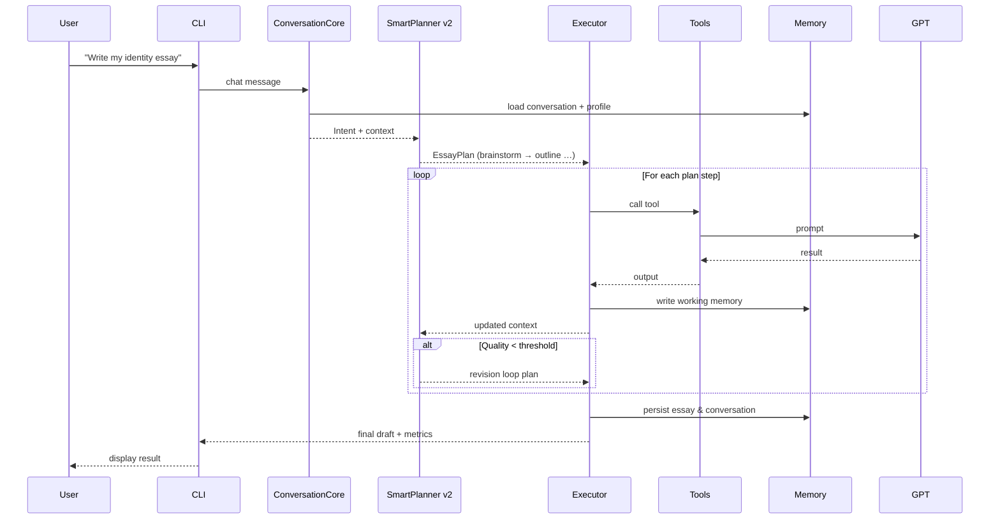

# 🏗️ Essay Agent Architecture

**Version**: Post-Phase 9 (Conversational CLI)  
**Updated**: July 15 2025

---

## 🎯 System Overview

• End-to-end essay assistant powered by GPT-4, orchestrated with LangGraph (ReAct pattern).  
• New **ConversationCore** bridges CLI ↔ planner, providing intent parsing, natural-language → tool mapping, and context upkeep.  
• **SmartPlanner v2** (planning.py) builds dynamic plans, honours deadlines/word limits, and drives evaluation-guided loops.  
• **Executor** runs LangGraph StateGraph with conditional edges, retries, and async tool calls.  
• **ToolRegistry** now stocks **35+ tools** (brainstorm → polish + inline edit set).  
• **Evaluation Harness** (eval/) provides automated quality metrics and regression tests.

```mermaid
flowchart LR
    U[👤 User]
    CLI[🖥️ CLI] 
    Conv[💬 ConversationCore]
    Planner[🧠 SmartPlanner v2]
    Exec[⚙️ LangGraph Executor]
    Tools[🔧 ToolRegistry]
    GPT[🤖 GPT-4 / OpenAI]
    Mem[💾 MemorySystem]

    U ⇄ CLI
    CLI ⇄ Conv
    Conv --> Planner
    Planner --> Exec
    Exec --> Tools
    Tools --> GPT
    Mem --> Conv
    Mem --> Planner
```

---

## 🧩 Component Breakdown (Post-Phase 9)

• `conversation.py` – intent detection, NL → tool routing, conversation memory hooks.  
• `planning.py` – SmartPlanner v2: dynamic plan generation, constraint handling, evaluation-driven branching.  
• `state_manager.py` – unified working + conversation memory buffers with token-aware truncation.  
• `executor.py` – LangGraph StateGraph, conditional edges, retry logic, async execution.  
• `cli.py` – new flags `--verbose`, `--steps`, and `essay-agent chat` mode for interactive sessions.  
• `eval/metrics.py` – readability, vocabulary, similarity & rubric scorers.  
• `eval/sample_prompts.py` – 5 diverse test prompts.  
• `eval/test_runs.py` – pytest harness executing full workflow per prompt.

---

## 🔄 Execution Flow



---

## 💾 Memory System (4 Layers)

1. **Working Memory** – current step outputs, transient.  
2. **Conversation Memory** – recent chat turns, manages dialog context.  
3. **Semantic Memory** – user profile, writing style, values, story seeds.  
4. **Episodic Memory** – historical essays, story usage tracking.

Memory APIs expose: `load_user_profile()`, `save_essay_history()`, `get_conversation_context()`, `update_working_memory()`.

---

## 🖥️ CLI Commands (v2)

| Command | Purpose | Key Flags |
|---------|---------|----------|
| `essay-agent write -p "…"` | Full workflow | `--verbose` (per-tool logs), `--steps` (start/stop phase) |
| `essay-agent chat` | Conversational mode | same `--verbose` |
| `essay-agent eval` | Run evaluation harness |  |

---

## 🧪 Testing & Evaluation

• `pytest essay_agent/eval/test_runs.py` runs 5 sample prompts → expects JSON shape, word-count ±5 %, keyword coverage, zero tool errors.  
• Metrics captured: readability, sentence variety, vocabulary richness, prompt similarity, pass/fail.  
• Generates `EvaluationReport` dataclass per prompt.

---

## ⚙️ Performance & Error Handling

• Async tool calls; max concurrency = CPU cores.  
• Exponential back-off retries for network / GPT errors.  
• Evaluation-driven revision loops (quality < 8/10 → revise ≤3 attempts).  
• CLI `--verbose` streams per-tool banners and timing.  
• Colored output via `rich` for human mode.

---

## 🔮 Future Roadmap

Next milestone = **Phase 10**: REST & WebSocket API exposing tools + conversation for frontend integration.  
Will add inline editing tools, FastAPI server, real-time collaboration, and production deployment scripts.