# 🏗️ Essay Agent Architecture - **ACTUAL SYSTEM REALITY**

**Version**: v0.17 System Validation - **REAL ARCHITECTURE DISCOVERED**  
**Updated**: January 16, 2025

---

## 🔍 **CRITICAL DISCOVERY: We Have TWO Different Systems**

After comprehensive codebase analysis and evaluation testing, I discovered we have **TWO COMPLETELY DIFFERENT ARCHITECTURES** running in parallel:

```mermaid
flowchart TD
    CLI[🖥️ CLI Entry Point] --> |"essay-agent write"| LEGACY[📝 Legacy EssayAgent]
    CLI --> |"essay-agent chat"| REACT[🤖 EssayReActAgent]
    CLI --> |"essay-agent eval-conversation"| REACT
    
    LEGACY --> PLANNER[📋 EssayPlanner]
    LEGACY --> EXECUTOR[⚙️ EssayExecutor] 
    PLANNER --> |Decides Tools| EXECUTOR
    EXECUTOR --> |Executes Plan| TOOLS[🔧 Tool Registry]
    
    REACT --> |Reasoning| LLM1[🧠 GPT-4 Reasoning]
    LLM1 --> |Action Decision| ACTION[⚙️ ActionExecutor]
    ACTION --> |Usually Fails| CONV[💬 Conversation Mode]
    ACTION --> |Rarely Succeeds| TOOLS
    REACT --> |Response Generation| LLM2[🧠 GPT-4 Response]
```



---

## 🎯 **SYSTEM 1: Legacy EssayAgent (WORKS) - True Planner-Executor**

**Command**: `essay-agent write "prompt text"`  
**Pattern**: Traditional planner-executor with workflow phases  
**Status**: ✅ **FUNCTIONAL** - This is the system you expected!

### **How It Actually Works:**
```python
# essay_agent/agent_legacy.py
class EssayAgent:
    def run(self, prompt, profile):
        plan = EssayPlan(phase=Phase.BRAINSTORMING, data={...})
        
        for step in range(max_steps):
            # PLANNER: Decide next tool based on current phase
            outputs = self.executor.run_plan(plan)  
            
            # EXECUTOR: Run tools in sequence
            plan.data["tool_outputs"].update(outputs)
            
            # AUTOMATIC PROGRESSION: brainstorm → outline → draft → revise → polish
            if "polish" in outputs:
                break
                
        return EssayResult(final_draft=outputs["polish"])
```

### **Execution Flow:**
1. **EssayPlanner** decides next tool based on phase + executed tools
2. **EssayExecutor** uses LangGraph to execute tools with retry logic  
3. **Sequential Progression**: Each tool builds on previous outputs
4. **Automatic Advancement**: Phases advance automatically after successful tool execution
5. **Final Output**: Complete essay after polish phase

**✅ THIS IS THE PLANNER-EXECUTOR PATTERN YOU DESCRIBED!**

---

## 🎯 **SYSTEM 2: EssayReActAgent (BROKEN) - Conversational Only**

**Commands**: `essay-agent chat`, `essay-agent eval-conversation`  
**Pattern**: Supposed to be ReAct, actually just conversational  
**Status**: ❌ **MOSTLY BROKEN** - Tool usage fails, defaults to chat

### **How It Actually Works (Evaluation Evidence):**
```python
# essay_agent/agent/core/react_agent.py
class EssayReActAgent:
    async def handle_message(self, user_input):
        # 1. OBSERVE: Get context from memory ✅ WORKS
        context = self._observe()
        
        # 2. REASON: Ask GPT-4 what to do ⚠️ PARTIALLY WORKS
        reasoning = await self._reason(user_input, context)
        # BUT: LLM returns conversation instead of JSON tool selection
        
        # 3. ACT: Execute chosen action ❌ FAILS
        action_result = await self._act(reasoning)
        # REALITY: Almost always defaults to conversation mode
        
        # 4. RESPOND: Generate natural language ✅ WORKS
        response = await self._respond(user_input, reasoning, action_result)
```

### **EVALUATION EVIDENCE (CONV-002 Results):**
- **4 conversation turns**: ALL were conversational responses
- **0 tools executed**: System never successfully used brainstorm, outline, draft, etc.
- **Reasoning failures**: GPT-4 returned conversational text instead of JSON tool selection
- **Fallback pattern**: Every reasoning failure → conversation mode

**❌ THIS IS NOT A PLANNER-EXECUTOR - IT'S A CHATBOT!**

---

## 🧩 **ACTUAL Architecture Components**

### **SYSTEM 1: Legacy EssayAgent (The Working One)**

#### **EssayPlanner** - Rule-Based Decision Engine
```python
# essay_agent/models.py + essay_agent/archive/planner.py
class EssayPlanner:
    def decide_next_action(self, user_input: str, context: Dict) -> EssayPlan:
        # DETERMINISTIC MAPPING: phase → tool
        outputs_now = context.get("tool_outputs", {})
        sequence = ["brainstorm", "outline", "draft", "revise", "polish"]
        next_tool = next((t for t in sequence if t not in outputs_now), "finish")
        return EssayPlan(phase=_phase_from_tool(next_tool), data={"next_tool": next_tool})
```

#### **EssayExecutor** - LangGraph Tool Orchestrator  
```python
# essay_agent/executor.py
class EssayExecutor:
    def _build_legacy_graph(self) -> StateGraph:
        workflow = StateGraph(EssayPlan)
        workflow.add_node("planner", self._run_planner)    # Plan next action
        workflow.add_node("executor", self._execute_tool)   # Execute tool
        workflow.add_edge("planner", "executor")
        workflow.add_conditional_edges("executor", self._decide_next_step, 
                                      {"continue": "planner", "end": END})
```

**✅ THIS IS A REAL PLANNER-EXECUTOR SYSTEM**

### **SYSTEM 2: EssayReActAgent (The Broken One)**

#### **ReasoningEngine** - LLM-Powered Decision Engine
```python
# essay_agent/agent/core/reasoning_engine.py
class ReasoningEngine:
    async def reason_about_action(self, user_input: str, context: Dict) -> ReasoningResult:
        # Ask GPT-4 to decide what tool to use in JSON format
        prompt = self.prompt_builder.build_reasoning_prompt(user_input, context)
        llm_response = await self.llm.apredict(prompt)
        
        # PROBLEM: GPT-4 often returns conversational text instead of JSON
        try:
            reasoning_dict = json.loads(llm_response)  # ❌ OFTEN FAILS
        except:
            # FALLBACK: Create conversation structure
            return ReasoningResult(response_type="conversation", ...)
```

#### **ActionExecutor** - Tool Execution Engine
```python
# essay_agent/agent/core/action_executor.py  
class ActionExecutor:
    async def execute_action(self, reasoning: Dict) -> ActionResult:
        if reasoning["response_type"] == "tool_execution":
            # Try to execute tool ⚠️ RARELY HAPPENS
            return await self._execute_tool_action(reasoning)
        else:
            # Default to conversation ❌ ALMOST ALWAYS HAPPENS
            return await self._execute_conversation_action(reasoning)
```

**❌ THIS SYSTEM FAILS TO USE TOOLS**

---

## 🔧 **Tool Integration Reality**

### **Legacy System Tool Usage (WORKS)**
```python
# Direct tool execution through EssayExecutor
tool_result = await registry.acall("brainstorm", essay_prompt="...", profile={...})
# ✅ SUCCESS: Tools get proper arguments and execute correctly
```

### **ReAct System Tool Usage (BROKEN)**  
```python
# Indirect tool execution through reasoning → action → conversation
reasoning = await reasoning_engine.reason_about_action(...)  # ❌ Returns conversation
action = await action_executor.execute_action(reasoning)     # ❌ Defaults to conversation  
response = await response_generator.generate_response(...)   # ✅ Generates chat response
```

**EVALUATION EVIDENCE:**
- **CONV-001**: 0 tools used, 3 conversation turns
- **CONV-002**: 0 tools used, 4 conversation turns  
- **Tool Selection Failures**: GPT-4 reasoning engine consistently fails to return proper JSON

---

## 💾 **Memory System Reality**

### **Memory Components (WORK)**
- ✅ **AgentMemory**: Stores conversations, reasoning chains, tool executions
- ✅ **ContextRetriever**: Retrieves relevant context from memory  
- ✅ **MemoryIndexer**: Indexes and searches conversation history
- ✅ **UserProfile**: Persistent user profile storage

### **Memory Integration (PARTIAL)**
- ✅ **Legacy System**: Memory used for profile persistence between runs
- ⚠️ **ReAct System**: Memory retrieval works, but tool integration fails
- ✅ **Evaluation System**: Memory persistence works for conversation tracking

---

## 🎓 **School Context Integration (WORKS)**

Both systems successfully integrate school-specific context:
- ✅ **Stanford Detection**: Automatically detects Stanford mentions
- ✅ **Harvard Context**: Applies Harvard-specific essay guidance  
- ✅ **Prompt Enhancement**: School context injected into tool prompts

---

## 🧪 **Evaluation Infrastructure Analysis**

### **ConversationRunner (WORKS)**
```python
# essay_agent/eval/conversation_runner.py
class ConversationRunner:
    async def execute_evaluation(self, scenario, profile):
        agent = EssayReActAgent(user_id=profile.profile_id)  # Uses broken system
        
        for phase in scenario.phases:
            response = await agent.handle_message(phase.user_input)  # Gets conversation only
            # PROBLEM: Agent never uses tools, only generates conversations
```

**EVALUATION RESULTS CONFIRM BROKEN TOOL USAGE:**
- **Naturalness**: 0.30 (low because responses are generic)
- **Goal Achievement**: 0.59 (medium because advice is helpful but no concrete outputs)
- **Tool Usage**: 0 (no tools ever executed)

---

## 🚨 **ROOT CAUSE ANALYSIS**

### **Why ReAct System Fails:**
1. **Reasoning Prompt Issues**: GPT-4 returns conversational text instead of JSON
2. **JSON Parsing Failures**: `json.loads()` fails → fallback to conversation mode
3. **Tool Selection Logic**: Never properly selects tools due to reasoning failures
4. **Parameter Mapping**: Tools never get called so parameter mapping is irrelevant

### **Why Legacy System Works:**
1. **Rule-Based Planning**: Deterministic phase-to-tool mapping
2. **Direct Tool Execution**: No JSON parsing or reasoning failures
3. **Sequential Workflow**: Clear brainstorm → outline → draft → revise → polish
4. **LangGraph Integration**: Robust execution with retry logic

---

## 🎯 **THE REAL ARCHITECTURE**

```mermaid
flowchart TD
    subgraph WORKING["✅ WORKING SYSTEM (essay-agent write)"]
        LP[EssayPlanner] --> |Phase-based Rules| LE[EssayExecutor]
        LE --> |LangGraph Workflow| TOOLS[36+ Tools]
        TOOLS --> |Sequential Output| ESSAY[Complete Essay]
    end
    
    subgraph BROKEN["❌ BROKEN SYSTEM (essay-agent chat)"]
        RA[EssayReActAgent] --> |LLM Reasoning| RE[ReasoningEngine] 
        RE --> |JSON Parsing Fails| AE[ActionExecutor]
        AE --> |Defaults to| CHAT[Conversation Only]
        CHAT --> |No Tools Used| NOTHING[No Essay Output]
    end
    
    USER[👤 User] --> |CLI Command| WORKING
    USER --> |CLI Command| BROKEN
    EVAL[🧪 Evaluations] --> |Uses| BROKEN
```



---

## 🔮 **RECOMMENDATIONS**

### **IMMEDIATE FIXES NEEDED**
1. **Fix ReAct Reasoning**: Make GPT-4 return proper JSON for tool selection
2. **Fix Tool Parameter Mapping**: Ensure tools get proper arguments
3. **Fix Workflow Progression**: Enable actual brainstorm → outline → draft progression
4. **Switch Evaluations**: Use working legacy system instead of broken ReAct system

### **ARCHITECTURAL DECISION**
You were RIGHT about wanting a planner-executor pattern. We HAVE that working system (legacy), but our evaluations are using the broken conversational system. 

**The solution is to EITHER:**
1. **Fix the ReAct system** to actually use tools properly, OR
2. **Use the legacy planner-executor system** for evaluations and production

---

## ✅ **SYSTEM VALIDATION CONCLUSION**

- **Legacy EssayAgent**: ✅ FUNCTIONAL planner-executor system  
- **EssayReActAgent**: ❌ BROKEN conversational-only system
- **Tool Registry**: ✅ COMPLETE with 36+ tools
- **Memory System**: ✅ FUNCTIONAL context and retrieval
- **Evaluation Infrastructure**: ⚠️ TESTING WRONG SYSTEM

**RECOMMENDATION**: Focus on fixing ReAct tool selection OR switch to legacy system for production.