# 🏗️ Essay Agent Architecture

**Version**: Post-Phase 9 (Conversational CLI)  
**Updated**: July 15 2025

---

## 🎯 System Overview

• End-to-end essay assistant powered by GPT-4, orchestrated with LangGraph (ReAct pattern).  
• New **ConversationCore** bridges CLI ↔ planner, providing intent parsing, natural-language → tool mapping, and context upkeep.  
• **SmartPlanner v2** (planning.py) builds dynamic plans, honours deadlines/word limits, and drives evaluation-guided loops.  
• **Executor** runs LangGraph StateGraph with conditional edges, retries, and async tool calls.  
• **ToolRegistry** now stocks **35+ tools** (brainstorm → polish + inline edit set).  
• **Evaluation Harness** (eval/) provides automated quality metrics and regression tests.

```mermaid
flowchart LR
    U[👤 User]
    CLI[🖥️ CLI] 
    Conv[💬 ConversationCore]
    Planner[🧠 SmartPlanner v2]
    Exec[⚙️ LangGraph Executor]
    Tools[🔧 ToolRegistry]
    GPT[🤖 GPT-4 / OpenAI]
    Mem[💾 MemorySystem]

    U ⇄ CLI
    CLI ⇄ Conv
    Conv --> Planner
    Planner --> Exec
    Exec --> Tools
    Tools --> GPT
    Mem --> Conv
    Mem --> Planner
```

---

## 🧩 Component Breakdown (Post-Phase 9)

• `conversation.py` – intent detection, NL → tool routing, conversation memory hooks.  
• `planning.py` – SmartPlanner v2: dynamic plan generation, constraint handling, evaluation-driven branching.  
• `state_manager.py` – unified working + conversation memory buffers with token-aware truncation.  
• `executor.py` – LangGraph StateGraph, conditional edges, retry logic, async execution.  
• `cli.py` – new flags `--verbose`, `--steps`, and `essay-agent chat` mode for interactive sessions.  
• `eval/metrics.py` – readability, vocabulary, similarity & rubric scorers.  
• `eval/sample_prompts.py` – 5 diverse test prompts.  
• `eval/test_runs.py` – pytest harness executing full workflow per prompt.

---

## 🔄 Execution Flow

```mermaid
sequenceDiagram
    participant U as User
    participant C as CLI
    participant V as ConversationCore
    participant P as SmartPlanner v2
    participant E as Executor
    participant T as Tools
    participant M as Memory

    U->>C: "Write my identity essay"
    C->>V: chat message
    V->>M: load conversation + profile
    V-->>P: Intent + context
    P-->>E: EssayPlan (brainstorm → outline …)
    loop For each plan step
        E->>T: call tool
        T->>GPT: prompt
        GPT-->>T: result
        T-->>E: output
        E->>M: write working memory
        E-->>P: updated context
        alt Quality < threshold
            P-->>E: revision loop plan
        end
    end
    E->>M: persist essay & conversation
    E-->>C: final draft + metrics
    C-->>U: display result
```



---

## 💾 Memory System (4 Layers)

1. **Working Memory** – current step outputs, transient.  
2. **Conversation Memory** – recent chat turns, manages dialog context.  
3. **Semantic Memory** – user profile, writing style, values, story seeds.  
4. **Episodic Memory** – historical essays, story usage tracking.

Memory APIs expose: `load_user_profile()`, `save_essay_history()`, `get_conversation_context()`, `update_working_memory()`.

---

## 🎨 Response Formatting Layer

The ReAct agent features an **intelligent LLM-powered formatting system** that dynamically transforms any tool output into beautiful, contextually appropriate responses.

### 🧠 LLM-Based Dynamic Formatting (Primary)
- **Context-Aware**: LLM understands user intent and adapts tone accordingly
- **Universal Compatibility**: Works with any tool automatically without manual configuration
- **Intelligent Presentation**: Creates engaging markdown with appropriate structure and next steps
- **Self-Healing**: Gracefully handles any data structure or format
- **Zero Maintenance**: No need to write tool-specific formatters

### 🛡️ Robust Fallback System
- **Smart Fallback**: When LLM formatting fails, intelligent fallback provides structured output
- **Tool-Specific Logic**: Fallback recognizes common patterns (brainstorm, evaluation, etc.)
- **Always Safe**: Guaranteed to return readable text even in edge cases
- **Performance**: Fast fallback ensures responsive user experience

### 🔧 Dual Output Modes
- **Human Mode (Default)**: LLM-generated beautiful responses for interactive use
- **JSON Mode**: Raw structured data for programmatic integration (via CLI `--json` flags)

### 📝 LLM Formatting Process
| Step | Process | Benefit |
|------|---------|---------|
| **Context Analysis** | LLM analyzes user intent and tool output | Contextually appropriate responses |
| **Intelligent Structuring** | Dynamic organization with headers, lists, emoji | Easy to scan and understand |
| **Next Steps Generation** | Suggests relevant follow-up actions | Guides user through essay process |
| **Tone Adaptation** | Matches communication style to user needs | Engaging, professional interaction |

### 🚀 Advantages Over Manual Formatting
- **99% Less Code**: Single LLM formatter vs hundreds of lines of tool-specific code
- **Infinite Adaptability**: Works with any current or future tool
- **Better Quality**: LLM understands semantic meaning and creates appropriate responses
- **Maintenance-Free**: No manual updates needed for new tools or data structures

---

## 🖥️ CLI Commands (v2)

| Command | Purpose | Key Flags |
|---------|---------|----------|
| `essay-agent write -p "…"` | Full workflow | `--verbose` (per-tool logs), `--steps` (start/stop phase) |
| `essay-agent chat` | Conversational mode | same `--verbose` |
| `essay-agent eval` | Run evaluation harness |  |

---

## 🧪 Testing & Evaluation

• `pytest essay_agent/eval/test_runs.py` runs 5 sample prompts → expects JSON shape, word-count ±5 %, keyword coverage, zero tool errors.  
• Metrics captured: readability, sentence variety, vocabulary richness, prompt similarity, pass/fail.  
• Generates `EvaluationReport` dataclass per prompt.

---

## ⚙️ Performance & Error Handling

• Async tool calls; max concurrency = CPU cores.  
• Exponential back-off retries for network / GPT errors.  
• Evaluation-driven revision loops (quality < 8/10 → revise ≤3 attempts).  
• CLI `--verbose` streams per-tool banners and timing.  
• Colored output via `rich` for human mode.

---

## 🔮 Future Roadmap

Next milestone = **Phase 10**: REST & WebSocket API exposing tools + conversation for frontend integration.  
Will add inline editing tools, FastAPI server, real-time collaboration, and production deployment scripts.