# 🏗️ Essay Agent Architecture

**Version**: Post-Phase 7.1 (CLI-Ready)  
**Status**: System Design Reference  
**Updated**: December 2024

---

## 🎯 System Overview

The Essay Agent is a **LangGraph-orchestrated, GPT-4-powered writing assistant** that guides users through a structured essay workflow: **brainstorming → outlining → drafting → revising → polishing**. The system uses a **ReAct (Reasoning + Acting) pattern** with intelligent planning, dynamic execution, and persistent memory.

### Core Architecture Principles

- **🧠 AI-First**: GPT-4 drives all creative and analytical decisions
- **🔄 ReAct Pattern**: Continuous reasoning and acting cycles
- **📈 LangGraph Orchestration**: State-based workflow management
- **🧩 Tool Registry**: Modular, composable tool ecosystem
- **💾 Hierarchical Memory**: Multi-layered context and history
- **🔍 Quality-Driven**: Continuous evaluation and improvement loops

---

## 📊 System Overview Diagram

```mermaid
graph TB
    User[👤 User] --> CLI[🖥️ CLI Interface]
    CLI --> Agent[🤖 EssayAgent]
    
    Agent --> Planner[🧠 Smart Planner]
    Agent --> Executor[⚙️ LangGraph Executor]
    Agent --> Memory[💾 Memory System]
    
    Planner --> |decides| Executor
    Executor --> |uses| ToolRegistry[🧩 Tool Registry]
    Memory --> |informs| Planner
    
    subgraph "Tool Registry"
        ToolRegistry --> BrainstormTool[🌟 Brainstorm]
        ToolRegistry --> OutlineTool[📝 Outline]
        ToolRegistry --> DraftTool[✍️ Draft]
        ToolRegistry --> RevisionTool[🔄 Revision]
        ToolRegistry --> PolishTool[✨ Polish]
        ToolRegistry --> EvalTools[📊 Evaluation Tools]
    end
    
    subgraph "Memory System"
        Memory --> UserProfile[👤 User Profile]
        Memory --> EssayHistory[📚 Essay History]
        Memory --> ConversationState[💬 Conversation State]
        Memory --> WorkingMemory[🧠 Working Memory]
    end
    
    subgraph "LangGraph Executor"
        Executor --> StateGraph[📈 State Graph]
        StateGraph --> ConditionalEdges[🔀 Conditional Edges]
        StateGraph --> RetryLogic[🔄 Retry Logic]
        StateGraph --> ErrorRecovery[🛠️ Error Recovery]
    end
    
    subgraph "External Services"
        ToolRegistry --> OpenAI[🤖 OpenAI GPT-4]
        Memory --> JSONFiles[📄 JSON Storage]
    end
```



---

## 🧩 Component Breakdown

### 1. **EssayAgent** (Main Orchestrator)
**File**: `essay_agent/agent.py`  
**Role**: High-level workflow orchestration and user-facing API

**Key Methods**:
- `run(prompt: str, profile: dict, debug: bool = False) -> EssayResult`
- `generate_essay(prompt: EssayPrompt) -> Dict[str, Any]`
- `get_progress() -> WorkflowProgress`

**Responsibilities**:
- Coordinates planner and executor
- Manages user sessions and context
- Handles debug mode and logging
- Provides error handling and recovery

---

### 2. **Smart Planner** (ReAct Decision Engine)
**File**: `essay_agent/planner.py`  
**Role**: Intelligent decision-making based on context and memory

**Core Algorithm**:
```python
def decide_next_action(self, context: Dict[str, Any]) -> EssayPlan:
    """
    REASONING PHASE:
    1. Analyze current state (phase, previous outputs, errors)
    2. Check memory for user context and constraints
    3. Evaluate essay quality metrics
    4. Determine optimal next action
    
    ACTING PHASE:
    5. Generate specific plan with tool selection
    6. Set conditional branching parameters
    7. Define success/failure criteria
    8. Return structured EssayPlan
    """
```

**Key Features**:
- **Context-Aware**: Uses tool outputs and memory state
- **Quality-Driven**: Loops until quality thresholds met
- **Story-Aware**: Prevents reuse across applications
- **Adaptive**: Adjusts strategy based on user profile

---

### 3. **LangGraph Executor** (Workflow Engine)
**File**: `essay_agent/executor.py`  
**Role**: Executes dynamic plans with conditional branching

**LangGraph State Management**:
```python
class EssayState(TypedDict):
    phase: Phase
    user_input: str
    tool_outputs: Dict[str, Any]
    essay_data: Dict[str, Any]
    errors: List[str]
    retry_count: int
    quality_score: float
```

**Conditional Execution Logic**:
```python
def should_retry(state: EssayState) -> bool:
    return (
        state["quality_score"] < QUALITY_THRESHOLD and
        state["retry_count"] < MAX_RETRIES
    )

def should_revise(state: EssayState) -> bool:
    return state["phase"] == Phase.DRAFTING and needs_revision(state)
```

**Key Features**:
- **Dynamic Branching**: Conditional edges based on quality
- **Retry Logic**: Exponential backoff for tool failures
- **State Persistence**: Maintains context across steps
- **Error Recovery**: Fallback strategies for each phase

---

### 4. **Tool Registry** (Modular Tool System)
**File**: `essay_agent/tools/__init__.py`  
**Role**: Centralized tool discovery and execution

**Tool Interface**:
```python
class ValidatedTool(BaseTool):
    def __init__(self, name: str, description: str, schema: BaseModel):
        self.name = name
        self.description = description
        self.schema = schema
    
    def run(self, **kwargs) -> ToolResult:
        # Validate inputs
        # Execute tool logic
        # Return structured result
```

**Core Workflow Tools**:

| Tool | Input | Output | Purpose |
|------|-------|---------|---------|
| **BrainstormTool** | `prompt, profile` | `List[StoryIdea]` | Generate story ideas |
| **OutlineTool** | `story, prompt` | `EssayOutline` | Create structured outline |
| **DraftTool** | `outline, profile` | `EssayDraft` | Write full essay draft |
| **RevisionTool** | `draft, feedback` | `RevisedDraft` | Improve essay content |
| **PolishTool** | `draft, word_limit` | `FinalEssay` | Final grammar/style polish |

**Support Tools**:
- **Evaluation Tools**: Quality scoring and feedback
- **Analysis Tools**: Prompt analysis and requirements extraction
- **Enhancement Tools**: Style, voice, and structure improvements

---

### 5. **Memory System** (Persistent Context)
**File**: `essay_agent/memory/`  
**Role**: Multi-layered memory management

**Memory Hierarchy**:

```
┌─────────────────────────────────────────┐
│           Working Memory                │
│  (Current conversation context)         │
│  • Tool outputs                         │
│  • Intermediate states                  │
│  • Quality metrics                      │
└─────────────────────────────────────────┘
                    ↓
┌─────────────────────────────────────────┐
│          Semantic Memory                │
│  (User profile and preferences)         │
│  • Writing style                        │
│  • Personal experiences                 │
│  • Values and themes                    │
└─────────────────────────────────────────┘
                    ↓
┌─────────────────────────────────────────┐
│          Episodic Memory                │
│  (Historical essay data)                │
│  • Previous essays                      │
│  • Story usage tracking                │
│  • Performance metrics                  │
└─────────────────────────────────────────┘
```

**Memory Operations**:
- `load_user_profile(user_id: str) -> UserProfile`
- `save_essay_history(user_id: str, essay: EssayRecord)`
- `check_story_reuse(story: str, college: str) -> bool`
- `get_writing_style(user_id: str) -> StyleProfile`

---

## 🔄 Execution Flow

### Phase-by-Phase Workflow


### Conditional Branching Logic

**Quality-Based Branching**:
```python
def determine_next_phase(current_state: EssayState) -> Phase:
    if current_state.quality_score < 6.0:
        return Phase.REVISING
    elif current_state.quality_score < 8.0:
        return Phase.POLISHING
    else:
        return Phase.COMPLETE
```

**Retry Logic**:
```python
def should_retry_tool(result: ToolResult) -> bool:
    return (
        result.success == False and
        result.retry_count < MAX_RETRIES and
        result.error_type in RETRYABLE_ERRORS
    )
```

---

## 🔌 Interfaces

### 1. **EssayAgent Public API**
```python
class EssayAgent:
    def run(
        self,
        prompt: str,
        profile: Dict[str, Any],
        debug: bool = False,
        max_retries: int = 3
    ) -> EssayResult:
        """
        Main entry point for essay generation.
        
        Args:
            prompt: Essay prompt text
            profile: User profile dictionary
            debug: Enable detailed logging
            max_retries: Maximum retry attempts
            
        Returns:
            EssayResult with final essay and metadata
        """
```

### 2. **Tool Interface**
```python
class ValidatedTool(BaseTool):
    def run(self, **kwargs) -> ToolResult:
        """
        Execute tool with validated inputs.
        
        Returns:
            ToolResult with success status and output
        """
```

### 3. **Memory Interface**
```python
class SimpleMemory:
    def load(self, user_id: str) -> UserProfile
    def save(self, user_id: str, profile: UserProfile) -> None
    def add_essay(self, user_id: str, essay: EssayRecord) -> None
    def check_story_reuse(self, story: str, college: str) -> bool
```

---

## 🖥️ CLI Integration Architecture (Phase 7.1)

### CLI Command Structure
```bash
essay-agent [COMMAND] [OPTIONS]

Commands:
  write       Generate a new essay
  revise      Revise an existing essay  
  profile     Manage user profile
  history     View essay history
  eval        Run evaluation tests

Options:
  --debug     Enable debug mode
  --profile   Specify user profile
  --output    Output file path
  --format    Output format (text/json)
```

### CLI Implementation Architecture

```python
# essay_agent/cli.py
class EssayAgentCLI:
    def __init__(self):
        self.agent = EssayAgent()
        self.memory = SimpleMemory()
    
    def write_essay(self, prompt: str, user_id: str, debug: bool = False):
        """Interactive essay writing session"""
        profile = self.memory.load(user_id)
        
        with Progress() as progress:
            task = progress.add_task("Generating essay...", total=5)
            
            result = self.agent.run(
                prompt=prompt,
                profile=profile,
                debug=debug,
                progress_callback=lambda: progress.advance(task)
            )
            
        self.display_result(result)
    
    def display_result(self, result: EssayResult):
        """Rich formatting for essay output"""
        console.print(Panel(result.final_essay, title="Final Essay"))
        console.print(f"Word count: {result.word_count}")
        console.print(f"Quality score: {result.quality_score}")
```

### CLI Integration Flow

```mermaid
graph LR
    CLI[🖥️ CLI] --> Parser[📝 Argument Parser]
    Parser --> Validator[✅ Input Validator]
    Validator --> Agent[🤖 EssayAgent]
    Agent --> Memory[💾 Memory System]
    Agent --> Progress[📊 Progress Display]
    Agent --> Output[📄 Output Formatter]
    Output --> CLI
```



---

## 📈 Performance & Scalability

### System Metrics
- **Latency**: ~45-90 seconds per complete essay
- **Throughput**: 1-2 essays per minute (sequential)
- **Memory Usage**: ~50MB per active session
- **Token Usage**: ~15,000-25,000 tokens per essay

### Optimization Strategies
1. **Caching**: Prompt template caching and response memoization
2. **Parallel Processing**: Concurrent tool execution where possible
3. **Memory Management**: Efficient context window management
4. **Rate Limiting**: Intelligent OpenAI API rate limiting

---

## 🛡️ Error Handling & Recovery

### Error Categories
1. **Tool Errors**: API failures, invalid responses
2. **Memory Errors**: File I/O issues, data corruption
3. **Validation Errors**: Invalid inputs, schema violations
4. **Quality Errors**: Below-threshold essay quality

### Recovery Strategies
```python
class ErrorRecovery:
    def handle_tool_error(self, error: ToolError) -> RecoveryAction:
        if error.is_retryable():
            return RetryAction(delay=exponential_backoff(error.retry_count))
        else:
            return FallbackAction(alternative_tool=error.fallback_tool)
    
    def handle_quality_error(self, state: EssayState) -> RecoveryAction:
        if state.retry_count < MAX_RETRIES:
            return RevisionAction(focus=identify_weak_areas(state.essay))
        else:
            return AcceptAction(with_warnings=True)
```

---

## 🔮 Future Architecture (Post-MVP)

### Phase 8+: Advanced Features
- **Multi-Agent Collaboration**: Specialized agents for different aspects
- **Vector Memory**: Semantic search for relevant experiences
- **Real-time Collaboration**: WebSocket-based live editing
- **Fine-tuned Models**: Replace GPT-4 with specialized models

### Phase 11: Model Fine-tuning
- **Data Collection**: Capture prompt/response pairs from MVP usage
- **Model Training**: Fine-tune specialized models for each tool
- **A/B Testing**: Compare fine-tuned vs. prompt-based performance
- **Gradual Replacement**: Migrate tools to fine-tuned models

---

## 📝 Summary

The Essay Agent architecture provides a **robust, scalable, and intelligent essay writing assistant** that combines:

✅ **Smart Planning**: Context-aware decision making with quality feedback loops  
✅ **Dynamic Execution**: LangGraph-based conditional workflow management  
✅ **Modular Tools**: Composable, validated tool ecosystem  
✅ **Persistent Memory**: Multi-layered context and history management  
✅ **Quality Assurance**: Continuous evaluation and improvement  
✅ **CLI Integration**: Professional command-line interface  

The system is designed for **incremental enhancement** while maintaining **production-ready reliability** and **user-friendly experience**.

---

**Next Steps**: Implement Phase 6 tasks to achieve this architecture vision.