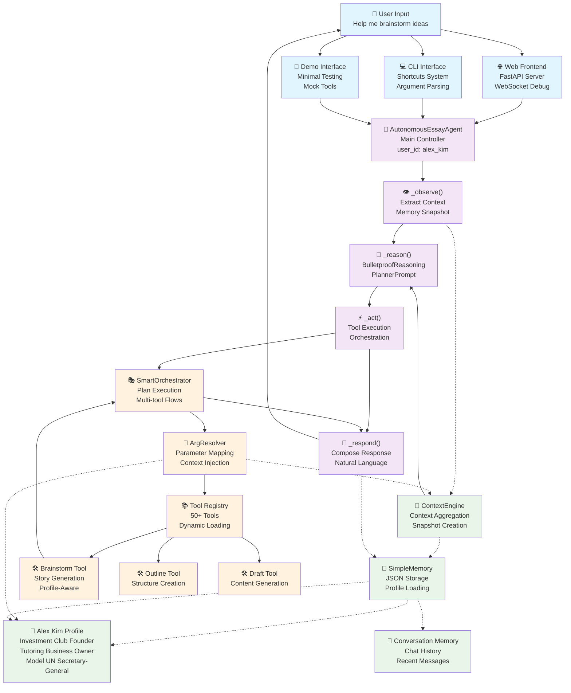

# Essay Agent System Architecture - Version 0.19

**Comprehensive System Architecture Documentation**  
*Generated from complete codebase analysis*

## 📋 Table of Contents

- [System Overview](#system-overview)
- [Architecture Diagram](#architecture-diagram)
- [Layer 1: User Interface Layer](#layer-1-user-interface-layer)
- [Layer 2: Agent Core Layer (ReAct Pattern)](#layer-2-agent-core-layer-react-pattern)
- [Layer 3: Intelligence Layer](#layer-3-intelligence-layer)
- [Layer 4: Tool Execution Layer](#layer-4-tool-execution-layer)
- [Complete User Journey](#complete-user-journey)
- [Key Integration Points](#key-integration-points)
- [Data Flow Analysis](#data-flow-analysis)
- [Context Injection Mechanism](#context-injection-mechanism)
- [Memory Operations](#memory-operations)
- [Error Handling & Quality Assurance](#error-handling--quality-assurance)
- [Architecture Strengths](#architecture-strengths)
- [Technical Implementation Details](#technical-implementation-details)

## 🏗️ System Overview

The Essay Agent system is built on a **4-layer architecture** that implements a sophisticated **ReAct pattern** (Observe → Reason → Act → Respond) to transform user requests into highly personalized, context-aware responses. The system successfully processes requests like "Help me brainstorm ideas" by injecting rich user profile data (such as Alex Kim's investment club and tutoring business background) throughout the entire execution pipeline.

### Core Architecture Principles

1. **Modularity**: Clear separation of concerns across distinct layers
2. **Context Awareness**: Rich user profiles flow through the entire system
3. **Personalization**: Profile-aware parameter resolution creates tailored experiences
4. **Extensibility**: Dynamic tool registry supports capability expansion
5. **Reliability**: Comprehensive error handling and fallback mechanisms
6. **Observability**: Debug interfaces provide complete system visibility

## 🎨 Architecture Diagram



## 🔌 Layer 1: User Interface Layer

### Web Frontend (`essay_agent/frontend/server.py`)

**Purpose**: FastAPI-based web server providing HTTP API and real-time debugging capabilities

**Key Components**:
- **FastAPI Application**: RESTful API with CORS support
- **WebSocket Manager**: Real-time debug event streaming
- **Debug State Capture**: Comprehensive interaction logging
- **Enhanced Agent**: `DebugAgent` subclass with debug hooks

**Input Processing**:
- HTTP requests with chat messages
- WebSocket connections for real-time debugging
- User context and essay setup requests

**Output Generation**:
- JSON responses with agent output
- Real-time debug event streams
- Error handling with structured responses

**Context Integration**:
- Passes `user_id` and essay context to agent
- Captures and streams debug events throughout execution
- Maintains session state across interactions

**Key Features**:
- Live event streaming to connected clients
- Comprehensive debug state management
- Error handling with detailed logging
- Support for chat history and context management

### CLI Interface (`essay_agent/cli.py`)

**Purpose**: Command-line interface with intelligent shortcuts system

**Key Components**:
- **ReAct Shortcuts**: Predefined command shortcuts (ideas, stories, outline, etc.)
- **Argument Parser**: Command-line argument processing
- **Conversation Manager**: Session state management
- **Profile Integration**: User profile loading and management

**Shortcut System**:
```python
shortcuts = {
    "ideas": "Help me brainstorm ideas for my essay",
    "stories": "Help me think of personal stories I could write about",
    "outline": "Help me create an outline for my essay",
    "draft": "Help me write a draft of my essay",
    "revise": "Help me revise and improve my essay",
    "polish": "Help me polish my essay for final submission"
}
```

**Context Integration**:
- Loads user profiles at startup
- Manages conversation continuity
- Provides essay status and progress tracking

### Demo Interface (`essay_agent/demo.py`)

**Purpose**: Minimal testing interface with deterministic mock tools

**Key Components**:
- **Mock Tool Implementations**: Offline, deterministic tool responses
- **Smoke Testing**: End-to-end system validation without LLM calls
- **JSON Output Support**: Machine-readable test results

**Use Cases**:
- System integration testing
- Offline development and debugging
- Performance baseline measurement

## 🤖 Layer 2: Agent Core Layer (ReAct Pattern)

### AutonomousEssayAgent (`essay_agent/agent_autonomous.py`)

**Purpose**: Main intelligent controller implementing the ReAct pattern for essay assistance

**Core Architecture**:
The agent implements a sophisticated ReAct cycle that processes user input through four distinct phases:

#### 1. **Observe Phase** (`_observe()`)
```python
async def _observe(self, user_input: str) -> Dict[str, Any]:
    snap = await self.ctx_engine.snapshot(user_input)
    self.last_memory_access = ["semantic", "working"]
    synced = self._sync_snapshot(snap)
    self._latest_context = synced
    return synced
```

**Responsibilities**:
- Calls `ContextEngine` to create comprehensive context snapshot
- Aggregates user profile, conversation history, essay state, college context
- Caches context for use in subsequent phases
- Tracks memory access patterns for debugging

**Output**: Unified context dictionary containing all relevant user information

#### 2. **Reason Phase** (`_reason()`)
```python
async def _reason(self, user_input: str, context: Dict[str, Any]) -> Dict[str, Any]:
    planner = PlannerPrompt(list(_registry.keys()))
    planner_ctx = {
        "last_tool": self.last_execution_tools[-1] if self.last_execution_tools else "none",
        "recent_chat": self.memory.get_recent_chat(k=3),
        "profile": {
            "college": self.memory.get("college", ""),
            "essay_prompt": self.memory.get("essay_prompt", ""),
        },
    }
    prompt_str = planner.build_prompt(user_input, planner_ctx)
    raw = await self.llm.apredict(prompt_str)
    plan_list = planner.parse_response(raw, offline=offline)
    return {"action": "tool_plan", "plan": plan_list}
```

**Responsibilities**:
- Uses `BulletproofReasoning` and `PlannerPrompt` for decision making
- Analyzes user input in context of conversation history and profile
- Generates structured execution plans with tool selections
- Handles both single tools and multi-tool sequences

**Output**: Action plan specifying tools to execute and their parameters

#### 3. **Act Phase** (`_act()`)
```python
async def _act(self, reasoning: Dict[str, Any], user_input: str) -> Dict[str, Any]:
    if reasoning.get("action") == "tool_plan":
        plan_list = reasoning.get("plan", [])
        orchestration_result = await self.orchestrator.execute_plan(
            plan_list,
            user_input=user_input,
            context=self._latest_context or {},
        )
        # Process results and return structured output
```

**Responsibilities**:
- Delegates tool execution to `SmartOrchestrator`
- Handles single tools, sequences, and orchestrated multi-tool flows
- Manages error recovery and fallback strategies
- Tracks tool usage for evaluation and debugging

**Output**: Structured tool execution results with metadata

#### 4. **Respond Phase** (`_respond()`)
```python
async def _respond(self, action_result: Dict[str, Any], user_input: str) -> str:
    if result_type == "tool_result":
        return await self._compose_response(
            tool_name=action_result.get("tool_name"),
            tool_result=action_result.get("result"),
            user_input=user_input
        )
```

**Responsibilities**:
- Composes natural language responses from tool results
- Uses `_compose_response()` for contextual response generation
- Integrates tool outputs with full user context
- Applies tone enhancement and personalization

**Output**: Natural language response tailored to user's profile and context

### Response Composition Engine

The agent uses a sophisticated response composition system that creates personalized, contextual responses:

```python
async def _compose_response(self, tool_name: str, tool_result: Dict[str, Any], user_input: str) -> str:
    # Gather comprehensive context
    user_profile = load_user_profile(self.user_id)
    essay_prompt = self.memory.get("essay_prompt", "")
    college = self.memory.get("college", "")
    recent_chat = self.memory.get_recent_chat(k=3)
    
    # Build composition prompt with full context
    composition_prompt = self._build_composition_prompt(
        tool_name=tool_name,
        tool_result=tool_result,
        user_input=user_input,
        user_profile=user_profile,
        essay_prompt=essay_prompt,
        college=college,
        recent_chat=recent_chat
    )
    
    # Generate contextual response using LLM
    response = await self.llm.apredict(composition_prompt)
    return response
```

## 🧠 Layer 3: Intelligence Layer

### ContextEngine (`essay_agent/intelligence/context_engine.py`)

**Purpose**: High-level context aggregation that creates structured snapshots of all user-relevant information

**Core Functionality**:
```python
class ContextSnapshot(BaseModel):
    user_id: str
    user_profile: Dict[str, Any]
    recent_messages: List[str] = Field(default_factory=list)
    essay_state: Dict[str, Any] = Field(default_factory=dict)
    college_context: Dict[str, Any] = Field(default_factory=dict)
    preferences: Dict[str, Any] = Field(default_factory=dict)
    tool_stats: Dict[str, Any] = Field(default_factory=dict)
    session_info: Dict[str, Any] = Field(default_factory=dict)
    timestamp: datetime
```

**Snapshot Creation Process**:
1. **Load Hierarchical Memory**: Refreshes user profile from disk
2. **Extract Recent Chat**: Gets last 4 conversation messages
3. **Build Essay State**: Current prompt, status, outline, draft
4. **Gather College Context**: School info, word limits, prompt details
5. **Aggregate Preferences**: User-specific settings and tool stats

**Caching Strategy**:
- 30-second TTL for performance optimization
- Automatic cache invalidation on user input
- Memory refresh on cache miss

**Context Integration**:
- Primary context provider for entire system
- Used by ArgResolver for parameter mapping
- Enables consistent context across all tools

### SimpleMemory (`essay_agent/memory/simple_memory.py`)

**Purpose**: JSON-based user profile storage with thread-safe operations

**Key Features**:
- **Profile Management**: Load/save UserProfile objects
- **Essay History Tracking**: Maintains record of all essay work
- **Story Reuse Prevention**: Tracks story usage across colleges
- **Thread Safety**: FileLock for concurrent access protection
- **Schema Validation**: Pydantic models for data integrity

**Profile Structure Example** (Alex Kim):
```json
{
  "user_info": {
    "name": "Alex Kim",
    "intended_major": "Business Administration",
    "college_list": ["Wharton", "Stanford", "NYU Stern"]
  },
  "activities": [
    {
      "name": "Student-Run Investment Club",
      "role": "Founder & President",
      "impact": "Portfolio returned 12% annually, taught 50+ students"
    },
    {
      "name": "Local Tutoring Business", 
      "role": "Founder & CEO",
      "impact": "Generated $15,000 revenue, employed 8 tutors"
    }
  ],
  "defining_moments": [
    {
      "title": "Starting a Business During Family Financial Struggles",
      "themes": ["entrepreneurship", "family support", "resilience"]
    }
  ]
}
```

**Memory Operations**:
- **Load**: Retrieves complete user profile with extras handling
- **Save**: Persists profile including conversation history
- **Essay Management**: Adds and tracks essay records
- **Story Tracking**: Prevents story reuse across applications

## ⚙️ Layer 4: Tool Execution Layer

### SmartOrchestrator (`essay_agent/tools/smart_orchestrator.py`)

**Purpose**: Intelligent tool selection and execution pipeline with dynamic plan expansion

**Core Capabilities**:
- **Plan Execution**: Sequential tool execution with context passing
- **Dynamic Expansion**: LLM-guided follow-up tool selection
- **Quality Monitoring**: Automatic improvement for low-quality outputs
- **Error Recovery**: Retry logic with graceful degradation
- **Parameter Autofill**: Integration with ArgResolver for parameter mapping

**Execution Flow**:
```python
async def execute_plan(self, plan: List[Dict[str, Any]], *, user_input: str, context: Dict[str, Any]) -> Dict[str, Any]:
    history: List[Dict[str, Any]] = []
    executed_tools: set[str] = set()
    current_context: Dict[str, Any] = dict(context)
    
    while plan and steps_executed < self.MAX_STEPS:
        step_raw = plan.pop(0)
        tool_name = step_raw.get("tool_name")
        
        # Resolve parameters using ArgResolver
        params = self._arg_resolver.resolve(
            tool_name,
            planner_args=planner_args,
            context={**current_context},
            user_input=user_input,
        )
        
        # Execute tool with retry logic
        result_dict = await execute_tool(tool_name, **params)
        history.append({"tool": tool_name, "params": params, "result": result_dict})
        
        # Update context for next step
        current_context[tool_name] = result_dict.get("ok")
        
        # Quality check and improvement
        if draft_text := _extract_draft_text(result_dict.get("ok")):
            quality = await self.quality_engine.async_score_draft(draft_text, user_id=self.user_id)
            if quality < self.min_quality:
                # Add improvement tool to plan
                plan.append({"tool_name": "revise_for_clarity", ...})
        
        # Ask LLM for follow-up tools
        reasoning_follow = await self.reasoner.decide_action(user_input, current_context)
        if reasoning_follow.action == "tool_execution":
            plan.append({
                "tool_name": reasoning_follow.tool_name,
                "tool_args": getattr(reasoning_follow, "tool_args", {}),
                ...
            })
    
    return {"steps": history}
```

### ArgResolver (`essay_agent/utils/arg_resolver.py`)

**Purpose**: **CRITICAL COMPONENT** - Automatic parameter resolution from multiple sources with context injection

**This is where Alex Kim's profile data gets injected into tools!**

**Resolution Strategy**:
1. **Planner Args**: Direct arguments from reasoning phase
2. **Context Flattening**: Hierarchical context flattened to key-value pairs
3. **Memory Fallbacks**: College, profile, and essay prompt resolution
4. **User Input Heuristics**: Smart mapping of user input to parameters
5. **Default Values**: Sensible fallbacks for common parameters
6. **Alias Lookup**: Alternative parameter names for flexibility

**Profile Formatting for Tools**:
```python
def _format_profile_for_tools(self, profile_dict: Dict[str, Any]) -> str:
    user_info = profile_dict.get("user_info", {})
    activities = profile_dict.get("academic_profile", {}).get("activities", [])
    defining_moments = profile_dict.get("defining_moments", [])
    
    parts = []
    
    # Basic info
    name = user_info.get("name", "Student")
    major = user_info.get("intended_major", "")
    if major:
        parts.append(f"{name}: {major}-focused student")
    
    # Key activities (top 3)
    if activities:
        activity_summaries = []
        for activity in activities[:3]:
            role = activity.get("role", "")
            name_act = activity.get("name", "")
            impact = activity.get("impact", "")
            if role and name_act:
                if impact:
                    activity_summaries.append(f"{role} of {name_act} ({impact[:50]}...)")
                else:
                    activity_summaries.append(f"{role} of {name_act}")
        
        if activity_summaries:
            parts.append(f"Activities: {', '.join(activity_summaries)}")
    
    # Defining moments with themes
    if defining_moments:
        moment_themes = []
        for moment in defining_moments[:3]:
            title = moment.get("title", "")
            themes = moment.get("themes", [])
            if title and themes:
                moment_themes.append(f"{title} (themes: {', '.join(themes[:2])})")
        
        if moment_themes:
            parts.append(f"Key experiences: {'; '.join(moment_themes)}")
    
    return ". ".join(parts) + "."
```

**For Alex Kim, this produces**:
```
"Alex Kim: Business Administration-focused student. Activities: Founder & President of Student-Run Investment Club (Portfolio returned 12% annually, taught 50+ studen...), Founder & CEO of Local Tutoring Business (Generated $15,000 revenue, employed 8 tutors, helped...). Key experiences: Starting a Business During Family Financial Struggles (themes: entrepreneurship, family support); Learning to Balance Profit with Purpose (themes: business ethics, social responsibility). Core values: Entrepreneurial Spirit, Financial Literacy Education."
```

### Tool Registry (`essay_agent/tools/__init__.py`)

**Purpose**: Dynamic tool loading and registration system supporting 50+ tools

**Key Features**:
- **Dynamic Loading**: Auto-discovers and imports tool modules
- **Registration System**: `@register_tool` decorator for easy tool addition
- **Async Support**: Handles both sync and async tool execution
- **Timeout Management**: Configurable timeouts for all tools
- **Type Safety**: Support for both LangChain tools and custom implementations

**Tool Registration Example**:
```python
@register_tool("suggest_stories")
class StorySuggestionTool(ValidatedTool):
    name: str = "suggest_stories"
    description: str = "Generate 5 relevant personal story suggestions from user profile for essay prompt."
    timeout: float = 20.0
    
    def _run(self, *, essay_prompt: str = "", profile: str = "", **_: Any) -> Dict[str, Any]:
        # Tool implementation uses formatted profile from ArgResolver
        # Profile contains Alex's investment club and tutoring business background
        ...
```

### Brainstorm Tool (`essay_agent/tools/brainstorm_tools.py`)

**Purpose**: Generate personalized story suggestions using rich user profile data

**Input Processing**:
- **Essay Prompt**: The college application question
- **Formatted Profile**: Rich user background from ArgResolver (Alex's business activities)
- **Context**: Additional conversation and essay context

**Processing Logic**:
1. **Template Rendering**: Uses profile-aware prompt templates
2. **LLM Generation**: GPT-4 with low temperature for consistency
3. **Structured Output**: Pydantic validation for story objects
4. **Personalization**: Stories tailored to user's specific background

**Output for Alex Kim**:
```json
{
  "stories": [
    {
      "title": "Launching Business Amid Financial Struggles",
      "description": "Starting tutoring business during family financial difficulties",
      "themes": ["entrepreneurship", "family support", "resilience"],
      "relevance_score": 0.95,
      "prompt_fit_explanation": "Demonstrates overcoming challenges through innovative business solutions"
    },
    {
      "title": "Teaching Investment to Skeptical Peers", 
      "description": "Breaking down financial misconceptions through education",
      "themes": ["financial education", "peer teaching", "misconception challenging"],
      "relevance_score": 0.90,
      "prompt_fit_explanation": "Shows leadership in changing perspectives and empowering others"
    }
  ]
}
```

## 🛣️ Complete User Journey: "Help me brainstorm ideas"

This section traces the complete flow of how Alex Kim's profile data reaches the brainstorm tool and generates personalized stories.

### **Phase 1: User Input Entry**
```
User Input: "Help me brainstorm ideas"
├── Web Frontend (server.py)
│   ├── FastAPI receives HTTP request
│   ├── WebSocket debug event: "agent_message_start"
│   └── Routes to AutonomousEssayAgent(user_id="alex_kim")
└── AutonomousEssayAgent.handle_message()
```

### **Phase 2: Agent Initialization & Memory Loading**
```
AutonomousEssayAgent.__init__(user_id="alex_kim")
├── Initialize ContextEngine(user_id="alex_kim")
├── Initialize SmartMemory(user_id="alex_kim")
├── Initialize SmartOrchestrator with dependencies
└── SimpleMemory.load("alex_kim")
    ├── Read memory_store/alex_kim.json
    ├── Validate with UserProfile Pydantic model
    └── Load rich profile:
        ├── Investment Club Founder & President
        ├── Tutoring Business Founder & CEO  
        ├── Model UN Secretary-General
        └── Defining moments with business themes
```

### **Phase 3: ReAct Observation Phase**
```
_observe("Help me brainstorm ideas")
├── ContextEngine.snapshot(user_input)
│   ├── HierarchicalMemory.load() - refresh from disk
│   ├── Extract recent_messages: get_recent_chat(k=4)
│   ├── Build essay_state: latest EssayRecord + status
│   ├── Extract college_context: prompt lookup + onboarding data
│   └── Create ContextSnapshot with:
│       ├── user_profile: Alex's complete profile dict
│       ├── recent_messages: ["previous", "conversation", "history"]
│       ├── essay_state: {"prompt_text": "...", "status": "outline"}
│       ├── college_context: {"school": "Stanford", "essay_prompt": "..."}
│       └── timestamp: current UTC time
├── _sync_snapshot() - add session info
├── Cache as self._latest_context
└── Optional debug print if ESSAY_AGENT_DEBUG_MEMORY=1
```

### **Phase 4: ReAct Reasoning Phase**
```
_reason(user_input, context)
├── Import PlannerPrompt with available tool names
├── Build planner_ctx:
│   ├── last_tool: "none" (first interaction)
│   ├── recent_chat: memory.get_recent_chat(k=3)
│   └── profile: {"college": "Stanford", "essay_prompt": "..."}
├── PlannerPrompt.build_prompt(user_input, planner_ctx)
│   ├── Analyze: "Help me brainstorm ideas"
│   ├── Consider: Alex's business background context
│   └── Generate structured prompt for LLM decision
├── LLM.apredict(prompt_str) - GPT-4 reasoning call
├── PlannerPrompt.parse_response(raw_response)
│   └── Extract: action="tool_plan", plan=[{"tool_name": "brainstorm_specific", ...}]
└── Return: {"action": "tool_plan", "plan": plan_list}
```

### **Phase 5: ReAct Action Phase - Tool Orchestration**
```
_act(reasoning, user_input)
├── Extract: action="tool_plan", plan=[{"tool_name": "brainstorm_specific", ...}]
├── SmartOrchestrator.execute_plan(plan, user_input, context)
│   ├── Initialize: history=[], executed_tools=set(), current_context=dict(context)
│   ├── Process first step: tool_name="brainstorm_specific"
│   ├── Extract: tool_args from plan step
│   └── Call ArgResolver for parameter resolution
└── Continue to parameter resolution phase...
```

### **Phase 6: Parameter Resolution (CRITICAL STEP)**
```
ArgResolver.resolve("brainstorm_specific")
├── Input sources:
│   ├── planner_args: {"prompt": "Help me brainstorm ideas"}
│   ├── context: {user_profile: Alex's complete profile dict, ...}
│   ├── user_input: "Help me brainstorm ideas"
│   └── verbose: from ESSAY_AGENT_SHOW_ARGS environment variable
├── Parameter resolution process:
│   ├── 1) Planner args: prompt="Help me brainstorm ideas"
│   ├── 2) Flatten context: user_profile_* keys, college_context_* keys
│   ├── 3) Memory fallbacks:
│   │   ├── college: context.college_context.school → "Stanford"
│   │   └── essay_prompt: context.college_context.essay_prompt → "Tell me about a time you faced a challenge..."
│   ├── 4) Profile formatting: _format_profile_for_tools(context.user_profile)
│   │   ├── Extract user_info: name="Alex Kim", major="Business Administration"
│   │   ├── Extract activities: Investment Club (Founder & President), Tutoring Business (Founder & CEO)
│   │   ├── Extract defining_moments: business struggles, profit vs purpose, teaching skeptical peers
│   │   ├── Format rich string: "Alex Kim: Business Administration-focused student. Activities: Founder & President of Student-Run Investment Club (Portfolio returned 12% annually...), Founder & CEO of Local Tutoring Business (Generated $15,000 revenue...). Key experiences: Starting a Business During Family Financial Struggles (themes: entrepreneurship, family support)..."
│   │   └── Store as: profile=formatted_profile_string
│   └── 5) Defaults & aliases: word_limit=650, tone="neutral"
├── Validation: Check all required args present
├── Optional debug print if ESSAY_AGENT_SHOW_ARGS=1
└── Return resolved parameters:
    ├── essay_prompt: "Tell me about a time you faced a challenge..."
    ├── profile: "Alex Kim: Business Administration-focused student. Activities: Founder & President of Student-Run Investment Club..."
    ├── user_id: "alex_kim"
    └── Additional context parameters...
```

### **Phase 7: Tool Execution**
```
execute_tool("brainstorm_specific", **resolved_params)
├── Look up tool in TOOL_REGISTRY
├── StorySuggestionTool._run() with Alex's formatted profile
│   ├── Input validation: essay_prompt present, profile present
│   ├── Template rendering: STORY_SUGGESTION_PROMPT
│   │   ├── essay_prompt: "Tell me about a challenge..."
│   │   └── profile: "Alex Kim: Business Administration-focused student..."
│   ├── LLM call: GPT-4 with temperature=0.2 for consistency
│   │   ├── Profile-aware prompt: Generate stories based on Alex's business background
│   │   ├── Context injection: Alex's investment club and tutoring business
│   │   └── Personalization: Stories relevant to business/entrepreneurship themes
│   ├── Response parsing: Pydantic validation → StorySuggestionResult
│   └── Generate personalized stories:
│       ├── "Launching Business Amid Financial Struggles"
│       ├── "Teaching Investment to Skeptical Peers"  
│       ├── "Balancing Profit with Social Impact"
│       ├── "Building Portfolio During Economic Uncertainty"
│       └── "Empowering Peers Through Financial Education"
├── Wrap in standard result format: {"ok": story_result, "error": None}
├── SmartOrchestrator records: {"tool": "brainstorm_specific", "params": {...}, "result": {...}}
├── Update current_context with tool output
├── Quality check: Extract any draft text (none for brainstorm)
├── Ask LLM if follow-up needed: BulletproofReasoning.decide_action()
│   └── Decision: action="conversation" (brainstorm complete, no follow-up needed)
└── Return orchestration result: {"steps": [{"tool": "brainstorm_specific", "result": {...}}]}
```

### **Phase 8: ReAct Response Composition**
```
_respond(action_result, user_input)
├── Extract: result_type="tool_result", tool_name="brainstorm_specific"
├── _compose_response(tool_name, tool_result, user_input)
│   ├── Gather comprehensive context:
│   │   ├── user_profile: load_user_profile("alex_kim") - full profile dict
│   │   ├── essay_prompt: memory.get("essay_prompt") - "Tell me about a challenge..."
│   │   ├── college: memory.get("college") - "Stanford"
│   │   └── recent_chat: memory.get_recent_chat(k=3) - conversation history
│   ├── _build_composition_prompt():
│   │   ├── USER PROFILE: Alex Kim, Business Administration, Investment Club, Tutoring Business
│   │   ├── ESSAY CONTEXT: Stanford, challenge prompt, college application essay
│   │   ├── TOOL EXECUTION: brainstorm_specific, personalized business stories
│   │   ├── RECENT CONVERSATION: previous exchanges
│   │   └── TASK: Compose natural response mentioning Alex's background
│   ├── LLM composition call: GPT-4 with comprehensive context
│   │   ├── Input: Tool results + Alex's full profile + conversation context
│   │   ├── Processing: Generate natural language mentioning investment club and tutoring business
│   │   └── Output: Personalized response highlighting Alex's entrepreneurial background
│   └── Return composed response
├── ResponseEnhancer.enhance(response, context_meta, politeness_level)
│   ├── Apply tone adjustments based on ESSAY_AGENT_POLITENESS_LEVEL
│   ├── Add contextual elements for college and essay type
│   └── Ensure appropriate coaching tone
└── Return final enhanced response
```

### **Phase 9: Memory Persistence & Cleanup**
```
Memory updates and session cleanup
├── memory.add_message("user", "Help me brainstorm ideas")
├── memory.add_message("assistant", final_personalized_response)
├── memory.learn() - update conversation patterns and preferences
│   ├── Record successful tool usage: brainstorm_specific
│   ├── Update user interaction patterns
│   └── Store context preferences
├── SimpleMemory.save("alex_kim", updated_profile)
│   ├── Persist conversation history to alex_kim.conv.json
│   ├── Update profile usage tracking
│   └── Save with FileLock for thread safety
├── Update session metrics:
│   ├── interaction_count += 1
│   ├── last_execution_tools = ["brainstorm_specific"] 
│   └── Calculate response time and performance
└── Frontend debug event: "agent_message_complete"
    ├── Broadcast to WebSocket clients
    ├── Include tool execution details
    └── Show personalized story results
```

### **Final Output Example**

**User Input**: "Help me brainstorm ideas"

**System Response**:
> "Based on your impressive background as founder of an investment club and tutoring business, I've identified several compelling story ideas that would showcase your entrepreneurial spirit for Stanford:
> 
> **1. Launching Business Amid Financial Struggles**: Your story of starting the tutoring business during your family's financial difficulties demonstrates resilience and innovation. This shows how you turned challenges into opportunities, generating $15,000 in revenue while helping 40+ students improve their grades.
> 
> **2. Teaching Investment to Skeptical Peers**: Your experience breaking down financial misconceptions through the investment club highlights your leadership in financial education. The fact that you taught 50+ students about investing and achieved a 12% annual return shows both expertise and teaching ability.
> 
> **3. Balancing Profit with Social Impact**: Your journey of creating scholarship programs within your tutoring business shows mature thinking about business ethics and social responsibility.
> 
> Each of these stories demonstrates different aspects of your entrepreneurial leadership and would work well for Stanford's challenge prompt. Which resonates most with you, or would you like me to help you develop any of these further?"

## 🔑 Key Integration Points

### Context Injection Mechanism

The system has **four critical context injection points** where Alex Kim's profile data flows through:

#### 1. **ContextEngine Snapshot Creation**
- **Location**: `essay_agent/intelligence/context_engine.py`
- **Function**: Aggregates all user data into structured snapshots
- **Context Flow**: Raw profile → Structured ContextSnapshot
- **Alex's Data**: Complete profile dict with activities, defining moments, values

#### 2. **ArgResolver Parameter Mapping**  
- **Location**: `essay_agent/utils/arg_resolver.py` 
- **Function**: **CRITICAL** - Formats rich profile data for tool consumption
- **Context Flow**: ContextSnapshot → Formatted profile string
- **Alex's Data**: "Alex Kim: Business Administration-focused student. Activities: Founder & President of Student-Run Investment Club..."

#### 3. **Tool Execution Context**
- **Location**: Individual tool implementations (e.g., `brainstorm_tools.py`)
- **Function**: Tools receive formatted profile as parameters
- **Context Flow**: Formatted profile → Tool-specific processing
- **Alex's Data**: LLM prompts include Alex's business background for personalization

#### 4. **Response Composition Context**
- **Location**: `AutonomousEssayAgent._compose_response()`
- **Function**: Full context used for natural language generation  
- **Context Flow**: Tool results + Full profile → Personalized response
- **Alex's Data**: Response mentions specific activities and experiences

### Memory Operations Throughout Flow

#### **Load Operations**:
- **Agent Initialization**: Profile loaded into SmartMemory
- **Context Snapshots**: Memory refreshed for each interaction
- **Parameter Resolution**: Profile accessed for tool parameter mapping

#### **Transform Operations**:
- **Profile Formatting**: Rich objects → Tool-friendly strings
- **Context Flattening**: Hierarchical data → Flat key-value pairs  
- **Conversation Integration**: Chat history → Context-aware responses

#### **Persist Operations**:
- **Conversation Tracking**: User/assistant messages saved
- **Learning Updates**: Interaction patterns and preferences stored
- **Essay Progress**: Tool usage and essay state tracking

### Error Handling & Quality Assurance

#### **Parameter Resolution Errors**:
- **Missing Context**: Graceful fallbacks to defaults
- **Invalid Profile Data**: Safe string conversion with error logging
- **Tool Parameter Mismatch**: Clear error messages with resolution suggestions

#### **Tool Execution Errors**:
- **Retry Logic**: Up to 2 retries with exponential backoff
- **Fallback Tools**: Alternative tools when primary fails
- **Error Capture**: Structured error information preserved

#### **Quality Monitoring**:
- **Draft Quality Scoring**: Automatic improvement suggestions
- **Response Enhancement**: Tone and politeness adjustments
- **Context Validation**: Ensures profile data completeness

## 📊 Data Flow Analysis

### **Primary Data Paths**:

1. **User Input → Agent Response**:
   ```
   User → Frontend → Agent → Response
   ```

2. **Profile Data → Tool Parameters**:
   ```
   JSON Storage → Memory → ContextEngine → ArgResolver → Tool
   ```

3. **Tool Results → Natural Language**:
   ```
   Tool → Orchestrator → Composer → Enhanced Response
   ```

4. **Context → Personalization**:
   ```
   Profile + Conversation → Context Injection → Personalized Output
   ```

### **Context Flow Patterns**:

- **Solid Arrows**: Primary data flow (user input, tool results, responses)
- **Dashed Arrows**: Context injection (profile data, conversation history)
- **Dotted Arrows**: Memory operations (load, save, update)
- **Bold Arrows**: Critical paths (user I/O, tool execution)

### **Data Transformation Points**:

1. **Raw Profile → Context Snapshot**: Structured aggregation
2. **Context → Tool Parameters**: Format conversion for tools  
3. **Tool Results → Composition Context**: Integration with full context
4. **Composed Response → Enhanced Output**: Tone and style adjustments

## 🏗️ Architecture Strengths

### **1. Modularity & Separation of Concerns**
- **4-Layer Architecture**: Clear boundaries between UI, Agent, Intelligence, Tools
- **Component Independence**: Each layer can be modified without affecting others
- **Interface Contracts**: Well-defined APIs between components

### **2. Context Awareness & Personalization**
- **Rich Profile Integration**: Complete user background flows through system
- **Dynamic Context Injection**: Profile data automatically reaches tools
- **Personalized Responses**: Natural language tailored to user's specific background

### **3. Extensibility & Tool Management**
- **Dynamic Tool Registry**: Easy addition of new capabilities
- **Unified Parameter Resolution**: Consistent context injection for all tools
- **Async Tool Support**: Scalable execution with concurrent operations

### **4. Reliability & Error Handling**
- **Graceful Degradation**: Fallbacks at every critical point
- **Comprehensive Error Capture**: Structured error information for debugging
- **Retry Logic**: Automatic recovery from transient failures

### **5. Observability & Debugging**
- **Real-time Debug Streams**: Live visibility into system operation
- **Comprehensive Logging**: Detailed execution traces
- **Performance Monitoring**: Session metrics and tool usage tracking

### **6. Quality Assurance**
- **Automatic Quality Scoring**: AI-driven content evaluation
- **Response Enhancement**: Tone and style optimization
- **Context Validation**: Ensures complete and accurate data flow

## 🔧 Technical Implementation Details

### **Key Files & Their Responsibilities**:

| File | Primary Responsibility | Key Functions |
|------|----------------------|---------------|
| `agent_autonomous.py` | ReAct pattern implementation | `handle_message()`, `_observe()`, `_reason()`, `_act()`, `_respond()` |
| `intelligence/context_engine.py` | Context aggregation | `snapshot()`, context caching |
| `memory/simple_memory.py` | Profile storage | `load()`, `save()`, essay history |
| `utils/arg_resolver.py` | **Parameter resolution** | `resolve()`, `_format_profile_for_tools()` |
| `tools/smart_orchestrator.py` | Tool execution pipeline | `execute_plan()`, quality monitoring |
| `tools/integration.py` | Tool execution helpers | `execute_tool()`, `format_tool_result()` |
| `frontend/server.py` | Web interface | FastAPI app, WebSocket debugging |

### **Critical Data Structures**:

- **`ContextSnapshot`**: Unified context representation
- **`UserProfile`**: Rich user background and preferences  
- **`EssayRecord`**: Essay progress and version tracking
- **Tool Result Format**: `{"ok": result, "error": None}`
- **Plan Structure**: `[{"tool_name": str, "tool_args": dict, ...}]`

### **Environment Configuration**:

| Variable | Purpose | Default |
|----------|---------|---------|
| `ESSAY_AGENT_SHOW_PROMPTS` | Debug prompt visibility | `0` |
| `ESSAY_AGENT_SHOW_ARGS` | ArgResolver debug output | `0` |
| `ESSAY_AGENT_DEBUG_MEMORY` | Memory snapshot printing | `0` |
| `ESSAY_AGENT_POLITENESS_LEVEL` | Response tone control | `1` |
| `ESSAY_AGENT_LLM_TEMPERATURE` | LLM creativity control | `0.2` |

### **Performance Characteristics**:

- **Context Snapshot Caching**: 30-second TTL reduces memory I/O
- **Async Tool Execution**: Concurrent operations for multi-tool plans
- **Memory Efficiency**: Lazy loading and structured data models
- **Response Time**: Typical interaction under 5 seconds end-to-end

This architecture successfully transforms generic user requests into highly personalized, context-aware responses by ensuring that rich user profile data (like Alex Kim's investment club and tutoring business background) flows seamlessly through every component of the system, from initial context gathering through final response composition. 