# 🏗️ Essay Agent v0.2: Complete Architecture Diagram

This diagram provides a comprehensive visual representation of the Essay Agent v0.2 architecture, showing all major components, data flows, and system interactions.

## 🎯 System Overview Architecture


## 🔄 Agentic Execution Flow Diagram

```mermaid
flowchart TD
    %% Styling
    classDef default fill:#000000,stroke:#333333,stroke-width:2px,color:#ffffff
    classDef stepBox fill:#1a237e,stroke:#3f51b5,stroke-width:2px,color:#ffffff
    classDef decisionBox fill:#b71c1c,stroke:#f44336,stroke-width:2px,color:#ffffff
    classDef memoryBox fill:#0f3460,stroke:#1e88e5,stroke-width:2px,color:#ffffff
    classDef outputBox fill:#1b5e20,stroke:#4caf50,stroke-width:2px,color:#ffffff
    
    %% User Input
    START[Student Input:<br/>"Help me make this paragraph more compelling"]:::stepBox
    
    %% 1. SENSE Phase
    SENSE[SENSE:<br/>Gather Hyperpersonalized Context]:::stepBox
    SENSE1[Query Core Memory<br/>Student Background & Goals]:::memoryBox
    SENSE2[Query Episodic Memory<br/>Recent Interactions & Progress]:::memoryBox
    SENSE3[Query Knowledge Vault<br/>Personal Insights & Strengths]:::memoryBox
    SENSE4[Analyze Current Essay Context<br/>Position, Content, Requirements]:::stepBox
    
    %% 2. REASON Phase
    REASON[REASON:<br/>Understand Intent with Personalization]:::stepBox
    REASON1[Analyze Surface Intent<br/>Text improvement request]:::stepBox
    REASON2[Identify Deeper Goals<br/>College fit, authentic voice]:::stepBox
    REASON3[Assess Personalization Opportunities<br/>Background integration potential]:::stepBox
    
    %% 3. PLAN Phase
    PLAN[PLAN:<br/>Create Personalized Execution Plan]:::stepBox
    PLAN1[Strategic: Goal Decomposition<br/>Improve while preserving voice]:::stepBox
    PLAN2[Tactical: Tool Sequencing<br/>Select improvement approach]:::stepBox
    PLAN3[Operational: Parameter Resolution<br/>User profile → tool inputs]:::stepBox
    
    %% 4. COORDINATE Phase
    COORDINATE[COORDINATE:<br/>Multi-Agent Collaboration]:::stepBox
    COORD1[Quality Agent Pre-approval<br/>Validate improvement strategy]:::stepBox
    COORD2[Memory Agent Context Injection<br/>Provide personalization data]:::stepBox
    COORD3[Planning Agent Optimization<br/>Refine execution approach]:::stepBox
    
    %% 5. ACT Phase
    ACT[ACT:<br/>Execute with Quality Gates]:::stepBox
    ACT1[Tool Execution<br/>Smart Improve Paragraph]:::stepBox
    ACT2[Real-time Quality Monitoring<br/>Voice preservation check]:::stepBox
    ACT3[Validation Pipeline<br/>Schema & quality validation]:::stepBox
    
    %% 6. UPDATE Phase
    UPDATE[UPDATE:<br/>Evolve Memory Understanding]:::stepBox
    UPDATE1[Store Interaction Results<br/>Success patterns & preferences]:::memoryBox
    UPDATE2[Update User Profile<br/>Writing style refinements]:::memoryBox
    UPDATE3[Generate New Insights<br/>Personalization improvements]:::memoryBox
    
    %% 7. CHECK Phase
    CHECK[CHECK:<br/>Assess Completion]:::decisionBox
    CHECK1[Intent Satisfaction<br/>Did we address the request?]:::decisionBox
    CHECK2[Quality Threshold<br/>Meets student's standards?]:::decisionBox
    CHECK3[Voice Preservation<br/>Maintains authenticity?]:::decisionBox
    CHECK4[Personalization Score<br/>Reflects student's background?]:::decisionBox
    
    %% Decision Point
    COMPLETE{Goal Complete?}:::decisionBox
    
    %% 8. RESPOND Phase
    RESPOND[RESPOND:<br/>Generate Final Response]:::stepBox
    RESPOND1[Compile Improved Text<br/>With explanation of changes]:::outputBox
    RESPOND2[Provide Personalized Coaching<br/>Based on student's learning style]:::outputBox
    RESPOND3[Suggest Next Steps<br/>Context-aware recommendations]:::outputBox
    
    %% Iteration Loop
    ITERATE[Iterate:<br/>Refine Approach]:::stepBox
    
    %% Final Output
    OUTPUT[Deliver to Sidebar:<br/>Improved paragraph + coaching insights]:::outputBox
    
    %% Flow Connections
    START --> SENSE
    SENSE --> SENSE1
    SENSE --> SENSE2
    SENSE --> SENSE3
    SENSE --> SENSE4
    SENSE1 --> REASON
    SENSE2 --> REASON
    SENSE3 --> REASON
    SENSE4 --> REASON
    
    REASON --> REASON1
    REASON --> REASON2
    REASON --> REASON3
    REASON1 --> PLAN
    REASON2 --> PLAN
    REASON3 --> PLAN
    
    PLAN --> PLAN1
    PLAN --> PLAN2
    PLAN --> PLAN3
    PLAN1 --> COORDINATE
    PLAN2 --> COORDINATE
    PLAN3 --> COORDINATE
    
    COORDINATE --> COORD1
    COORDINATE --> COORD2
    COORDINATE --> COORD3
    COORD1 --> ACT
    COORD2 --> ACT
    COORD3 --> ACT
    
    ACT --> ACT1
    ACT --> ACT2
    ACT --> ACT3
    ACT1 --> UPDATE
    ACT2 --> UPDATE
    ACT3 --> UPDATE
    
    UPDATE --> UPDATE1
    UPDATE --> UPDATE2
    UPDATE --> UPDATE3
    UPDATE1 --> CHECK
    UPDATE2 --> CHECK
    UPDATE3 --> CHECK
    
    CHECK --> CHECK1
    CHECK --> CHECK2
    CHECK --> CHECK3
    CHECK --> CHECK4
    CHECK1 --> COMPLETE
    CHECK2 --> COMPLETE
    CHECK3 --> COMPLETE
    CHECK4 --> COMPLETE
    
    COMPLETE -->|Yes| RESPOND
    COMPLETE -->|No| ITERATE
    ITERATE --> PLAN
    
    RESPOND --> RESPOND1
    RESPOND --> RESPOND2
    RESPOND --> RESPOND3
    RESPOND1 --> OUTPUT
    RESPOND2 --> OUTPUT
    RESPOND3 --> OUTPUT
```

## 🧠 Memory System Architecture Detail


## 🛠️ Tool System Architecture


## 📱 Cursor Sidebar Integration Architecture

```mermaid
graph TB
    %% Styling
    classDef default fill:#000000,stroke:#333333,stroke-width:2px,color:#ffffff
    classDef editorBox fill:#2e7d32,stroke:#4caf50,stroke-width:2px,color:#ffffff
    classDef sidebarBox fill:#d84315,stroke:#ff5722,stroke-width:2px,color:#ffffff
    classDef apiBox fill:#7b1fa2,stroke:#9c27b0,stroke-width:2px,color:#ffffff
    classDef uiBox fill:#1a237e,stroke:#3f51b5,stroke-width:2px,color:#ffffff
    classDef syncBox fill:#f57f17,stroke:#ffeb3b,stroke-width:2px,color:#ffffff
    
    %% Editor Layer
    EDITOR[Student's Text Editor<br/>VS Code, Cursor, etc.]:::editorBox
    ESSAY[Essay Document<br/>Stanford Leadership Essay]:::editorBox
    SELECTION[Text Selection<br/>Highlighted paragraph for improvement]:::editorBox
    
    %% Sidebar Integration Hub
    CSI[Cursor Sidebar Integration<br/>Real-time Writing Companion]:::sidebarBox
    
    %% Text Selection API
    TSA[Text Selection API<br/>Advanced Editor Integration]:::apiBox
    TSA1[Capture Text Selection<br/>Range, context, position analysis]:::apiBox
    TSA2[Handle Improvement Requests<br/>Context-aware text enhancement]:::apiBox
    TSA3[Monitor Editor Events<br/>Selection, edit, cursor, save events]:::apiBox
    
    %% Essay Context Tracker
    ECT[Essay Context Tracker<br/>Continuous State Awareness]:::apiBox
    ECT1[Track Essay Evolution<br/>Content changes, progress metrics]:::apiBox
    ECT2[Analyze Structure<br/>Introduction, body, conclusion detection]:::apiBox
    ECT3[Provide Contextual Assistance<br/>Phase-appropriate suggestions]:::apiBox
    
    %% Session Manager
    SSM[Sidebar Session Manager<br/>Persistent Context Management]:::apiBox
    SSM1[Create/Restore Sessions<br/>Essay-specific memory restoration]:::apiBox
    SSM2[Handle Interruptions<br/>Editor close, system restart recovery]:::apiBox
    SSM3[Maintain Conversation History<br/>Cross-session continuity]:::apiBox
    
    %% UI Interface
    SUI[Sidebar UI Interface<br/>Natural Conversation & Progress]:::uiBox
    SUI1[Conversation Thread<br/>Student ↔ Agent dialogue]:::uiBox
    SUI2[Progress Indicators<br/>Essay completion, phase tracking]:::uiBox
    SUI3[Memory Insights Panel<br/>Personalization transparency]:::uiBox
    SUI4[Quick Actions<br/>Context-sensitive suggestions]:::uiBox
    
    %% Real-Time Sync
    RTS[Real-Time Sync Engine<br/>Editor ↔ Sidebar Synchronization]:::syncBox
    RTS1[WebSocket Connection<br/>Bidirectional real-time communication]:::syncBox
    RTS2[Essay Change Processing<br/>Live content synchronization]:::syncBox
    RTS3[Context Updates<br/>Sidebar awareness of essay state]:::syncBox
    
    %% Agent Integration
    AGENT[Essay Agent Environment<br/>Full AI System Integration]:::default
    
    %% Data Flows
    EDITOR --> ESSAY
    ESSAY --> SELECTION
    SELECTION --> CSI
    
    CSI --> TSA
    CSI --> ECT
    CSI --> SSM
    CSI --> SUI
    CSI --> RTS
    
    %% Text Selection API Details
    TSA --> TSA1
    TSA --> TSA2
    TSA --> TSA3
    
    %% Essay Context Tracker Details
    ECT --> ECT1
    ECT --> ECT2
    ECT --> ECT3
    
    %% Session Manager Details
    SSM --> SSM1
    SSM --> SSM2
    SSM --> SSM3
    
    %% UI Interface Details
    SUI --> SUI1
    SUI --> SUI2
    SUI --> SUI3
    SUI --> SUI4
    
    %% Real-Time Sync Details
    RTS --> RTS1
    RTS --> RTS2
    RTS --> RTS3
    
    %% Integration with Agent System
    CSI <--> AGENT
    TSA --> AGENT
    ECT --> AGENT
    SSM --> AGENT
    
    %% Bidirectional Communication
    EDITOR <--> RTS1
    SUI1 <--> TSA2
    ECT1 <--> RTS2
    SSM1 <--> RTS3
```



This comprehensive architecture diagram captures every major component of Essay Agent v0.2, from the user interface down to the memory storage layer. The black boxes with white text provide clear visual separation while maintaining readability. Each diagram focuses on a different aspect of the system:

1. **System Overview**: Shows the complete architecture with all major components
2. **Agentic Execution Flow**: Details the SENSE → REASON → PLAN → ACT → CHECK loop
3. **Memory System Detail**: Breaks down the six-bank MIRIX system with Cognitive Weave
4. **Tool System**: Shows all 8 core tools with their input/output schemas
5. **Sidebar Integration**: Details the cursor integration with real-time synchronization

You can edit any aspect of these diagrams before we begin implementation. The visual representation should help identify any architectural components that need adjustment or additional detail. 